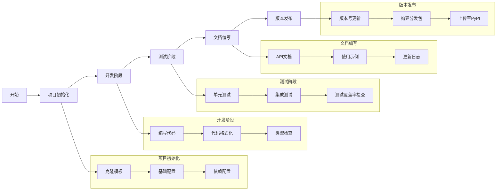

# Python PyPI 库模板

这是一个用于创建可发布到PyPI的Python库的模板项目。它提供了一个完整的项目结构和配置，使您能够快速开始开发自己的Python库。

本模板旨在解决Python库开发中的常见问题，提供标准化的项目结构和最佳实践，帮助开发者专注于核心功能的实现，而不是项目配置和结构设计。无论您是开发工具库、数据处理包还是Web框架，本模板都能为您提供坚实的基础。

> **🔰 新手友好提示**：如果您是第一次创建Python库，不用担心！本文档提供了详细的保姆级指南，帮助您一步步完成从模板到成品库的转换过程。

## 为什么选择这个模板？

- 🚀 **快速启动**: 提供完整的项目骨架，无需从零开始
- 📦 **标准配置**: 遵循Python包开发的最佳实践
- 🛠 **开发工具**: 集成常用的代码质量和测试工具
- 📝 **详细文档**: 提供保姆级教程，适合新手入门
- 🔄 **CI/CD**: 预配置GitHub Actions，自动化测试和发布
- 🎯 **类型安全**: 内置类型提示支持，提高代码质量

## 适用场景

- 开发Python工具库或SDK
- 创建数据处理或分析包
- 构建Web框架或扩展
- 打包机器学习模型
- 发布命令行工具
- 任何需要打包分发的Python项目

## 特性

- 完整的项目结构和配置
- 集成测试框架（pytest）
- 代码质量工具（black, isort, flake8, mypy）
- 自动化CI/CD流程（GitHub Actions）
- 完整的文档支持（Sphinx）
- 类型提示支持
- 开发工具集成（pre-commit, tox）

## 特性

- 完整的项目结构和配置
- 集成测试框架（pytest）
- 代码质量工具（black, isort, flake8, mypy）
- 自动化CI/CD流程（GitHub Actions）
- 完整的文档支持（Sphinx）
- 类型提示支持
- 开发工具集成（pre-commit, tox）

## 快速开始

### 使用这个模板

1. 点击GitHub上的"Use this template"按钮创建一个新的仓库
2. 克隆您的新仓库到本地
   ```bash
   git clone https://github.com/您的用户名/您的仓库名.git
   cd 您的仓库名
   ```
3. 运行初始化脚本
   ```bash
   # 赋予脚本执行权限
   chmod +x setup.sh
   # 运行初始化脚本
   ./setup.sh
   ```
   
   setup.sh 脚本会帮助您：
   - 收集必要的项目信息（包名、GitHub用户名、项目描述等）
   - 创建并激活Python虚拟环境
   - 重命名示例包目录
   - 更新项目配置文件
   - 安装开发依赖
   - 初始化Git钩子
   - 创建基础文档结构

   > 注意：脚本运行完成后，您将处于激活的虚拟环境中。如需退出虚拟环境，请运行 `deactivate` 命令。

4. 按照下面的指南继续自定义您的项目

### 安装开发环境

```bash
# 创建并激活虚拟环境
python -m venv venv
source venv/bin/activate  # 在Windows上使用: venv\Scripts\activate

# 安装开发依赖
pip install -e ".[dev]"
```

### 项目结构
```
.
├── LICENSE                 # Apache 2.0 许可证
├── README.md               # 项目说明文档
├── pyproject.toml          # 项目配置文件
├── src/                    # 源代码目录
│   └── example_package/    # 包目录（重命名为您的包名）
│       ├── __init__.py     # 包初始化文件
│       └── ...             # 其他模块
└── tests/                  # 测试目录
    └── ...                 # 测试文件
```

### 开发到发布流程



## 将模板转换为您的项目

将此模板转换为您自己的项目需要几个关键步骤。以下是一个完整的转换流程，即使您是编程新手也能轻松完成：

### 第1步：项目初始化

1. **使用模板创建新仓库**
   - 访问GitHub上的模板仓库页面
   - 点击页面上方的绿色按钮"Use this template"（使用此模板）
   - 填写您的新仓库名称（建议使用您计划的包名）
   - 选择公开或私有仓库
   - 点击"Create repository from template"（从模板创建仓库）

2. **克隆新仓库到本地**
   ```bash
   git clone https://github.com/您的用户名/您的仓库名.git
   cd 您的仓库名
   ```

3. **创建并激活虚拟环境**
   - 这一步非常重要，它可以隔离项目依赖，避免与系统其他Python项目冲突
   ```bash
   # 在项目根目录下创建虚拟环境
   python -m venv venv
   
   # 在macOS/Linux上激活虚拟环境
   source venv/bin/activate
   
   # 在Windows上激活虚拟环境
   venv\Scripts\activate
   ```
   
   激活成功后，您的命令行前面会出现`(venv)`前缀

4. **安装开发依赖**
   ```bash
   # 安装项目及其开发依赖
   pip install -e ".[dev]"
   ```
   
   这条命令会以可编辑模式安装您的包，同时安装所有开发所需的依赖项

5. **初始化Git钩子**（可选但强烈推荐）
   ```bash
   pre-commit install
   ```
   
   这会在每次提交代码前自动运行代码格式化和检查，确保代码质量

### 第2步：基础配置

1. **在`pyproject.toml`中修改项目元数据**：
   - 打开`pyproject.toml`文件，这是项目的核心配置文件
   - 修改以下关键字段：
     - `name`: 您的包名（确保在PyPI上是唯一的）
     - `version`: 版本号（遵循[语义化版本规范](https://semver.org/lang/zh-CN/)）
     - `description`: 项目简短描述（50-100字为宜）
     - `authors`: 作者信息，包括姓名和电子邮件
     - `classifiers`: 根据您的项目特点选择合适的分类（可在[PyPI分类列表](https://pypi.org/classifiers/)查看）
     - `dependencies`: 项目依赖项（列出您的包运行所需的所有外部包）
     - `optional-dependencies`: 可选依赖项（按功能分组）
     - `project.urls`: 更新项目相关链接，如主页、文档、源码仓库等
   
   修改前后对比示例：
   ```toml
   # 修改前
   [project]
   name = "example_package"
   version = "0.1.0"
   description = "A template package for PyPI distribution"
   authors = [
       {name = "Your Name", email = "your.email@example.com"}
   ]
   
   # 修改后
   [project]
   name = "your_package_name"
   version = "0.1.0"
   description = "您的项目描述：简洁明了地说明包的功能和用途"
   authors = [
       {name = "您的姓名", email = "您的邮箱@example.com"}
   ]
   ```
   
   同样更新项目URL：
   ```toml
   [project.urls]
   "Homepage" = "https://github.com/您的用户名/您的仓库名"
   "Bug Tracker" = "https://github.com/您的用户名/您的仓库名/issues"
   "Documentation" = "https://您的仓库名.readthedocs.io/"
   ```

2. **重命名包目录**：
   - 将示例包目录重命名为您的包名：
   ```bash
   # 在项目根目录下执行
   mv src/example_package src/your_package_name
   ```
   
   - 然后更新所有导入语句和引用。可以使用以下命令查找需要更新的地方：
   ```bash
   # 查找所有包含example_package的文件
   grep -r "example_package" .
   ```
   
   - 您需要修改的文件通常包括：
     - `tests/test_example.py`中的导入语句
     - `.github/workflows/ci.yml`中的测试路径
     - 任何其他引用了原包名的文件
   
   - 例如，在测试文件中：
   ```python
   # 修改前
   from example_package import __version__
   from example_package.core import DataPoint, ExampleClass
   
   # 修改后
   from your_package_name import __version__
   from your_package_name.core import DataPoint, ExampleClass
   ```

3. **更新包的初始化文件**：
   - 编辑`src/your_package_name/__init__.py`文件：
     - 更新文档字符串，清晰描述包的用途
     - 保持或修改版本号
     - 导入并暴露您希望用户可以直接访问的类和函数
     - 配置`__all__`列表，明确指定公开API
   
   ```python
   """您的包描述。
   
   详细说明包的用途、主要功能和使用场景。
   可以包含简短的示例代码。
   """
   
   __version__ = "0.1.0"
   
   # 导入您希望用户可以直接访问的类和函数
   from .core import ExampleClass, utility_function
   
   # 明确指定公开的API
   __all__ = ["ExampleClass", "utility_function"]
   ```

4. **更新许可证信息**：
   - 修改`LICENSE`文件：
     - 更新版权声明中的年份和所有者信息
     - 例如：`Copyright (c) 2023 您的姓名或组织`
   
   - 如果需要更换许可证类型：
     - 可以选择其他常见的开源许可证，如MIT（更宽松）或GPL（更严格）
     - 在[choosealicense.com](https://choosealicense.com/)选择合适的许可证
     - 替换整个LICENSE文件内容
     - 同时更新`pyproject.toml`中的license字段：
       ```toml
       license = {text = "MIT"} # 或其他许可证
       ```

5. **更新文档**：
   - 修改`README.md`文件：
     - 更新项目标题和描述
     - 添加安装说明（如`pip install your_package_name`）
     - 提供基本的使用示例代码
     - 说明主要功能和特性
     - 添加贡献指南和联系方式
   
   - 创建更详细的文档（可选但推荐）：
     - 创建`docs/`目录并使用Sphinx设置文档框架
     - 为每个模块、类和函数编写详细的文档字符串
     - 添加教程和高级用法示例
   
   - 创建`CHANGELOG.md`文件记录版本变更：
     ```markdown
     # 更新日志
     
     ## 0.1.0 (2023-XX-XX)
     
     - 初始版本发布
     - 实现了核心功能X
     - 添加了Y特性
     ```

## 将模板转换为您的项目

将此模板转换为您自己的项目需要几个关键步骤。以下是一个完整的转换流程，即使您是编程新手也能轻松完成：

### 第1步：项目初始化

1. **使用模板创建新仓库**
   - 访问GitHub上的模板仓库页面
   - 点击页面上方的绿色按钮"Use this template"（使用此模板）
   - 填写您的新仓库名称（建议使用您计划的包名）
   - 选择公开或私有仓库
   - 点击"Create repository from template"（从模板创建仓库）

2. **克隆新仓库到本地**
   ```bash
   git clone https://github.com/您的用户名/您的仓库名.git
   cd 您的仓库名
   ```

3. **创建并激活虚拟环境**
   - 这一步非常重要，它可以隔离项目依赖，避免与系统其他Python项目冲突
   ```bash
   # 在项目根目录下创建虚拟环境
   python -m venv venv
   
   # 在macOS/Linux上激活虚拟环境
   source venv/bin/activate
   
   # 在Windows上激活虚拟环境
   venv\Scripts\activate
   ```
   
   激活成功后，您的命令行前面会出现`(venv)`前缀

4. **安装开发依赖**
   ```bash
   # 安装项目及其开发依赖
   pip install -e ".[dev]"
   ```
   
   这条命令会以可编辑模式安装您的包，同时安装所有开发所需的依赖项

5. **初始化Git钩子**（可选但强烈推荐）
   ```bash
   pre-commit install
   ```
   
   这会在每次提交代码前自动运行代码格式化和检查，确保代码质量

### 第2步：基础配置

1. **在`pyproject.toml`中修改项目元数据**：
   - 打开`pyproject.toml`文件，这是项目的核心配置文件
   - 修改以下关键字段：
     - `name`: 您的包名（确保在PyPI上是唯一的）
     - `version`: 版本号（遵循[语义化版本规范](https://semver.org/lang/zh-CN/)）
     - `description`: 项目简短描述（50-100字为宜）
     - `authors`: 作者信息，包括姓名和电子邮件
     - `classifiers`: 根据您的项目特点选择合适的分类（可在[PyPI分类列表](https://pypi.org/classifiers/)查看）
     - `dependencies`: 项目依赖项（列出您的包运行所需的所有外部包）
     - `optional-dependencies`: 可选依赖项（按功能分组）
     - `project.urls`: 更新项目相关链接，如主页、文档、源码仓库等
   
   修改前后对比示例：
   ```toml
   # 修改前
   [project]
   name = "example_package"
   version = "0.1.0"
   description = "A template package for PyPI distribution"
   authors = [
       {name = "Your Name", email = "your.email@example.com"}
   ]
   
   # 修改后
   [project]
   name = "your_package_name"
   version = "0.1.0"
   description = "您的项目描述：简洁明了地说明包的功能和用途"
   authors = [
       {name = "您的姓名", email = "您的邮箱@example.com"}
   ]
   ```
   
   同样更新项目URL：
   ```toml
   [project.urls]
   "Homepage" = "https://github.com/您的用户名/您的仓库名"
   "Bug Tracker" = "https://github.com/您的用户名/您的仓库名/issues"
   "Documentation" = "https://您的仓库名.readthedocs.io/"
   ```

2. **重命名包目录**：
   - 将示例包目录重命名为您的包名：
   ```bash
   # 在项目根目录下执行
   mv src/example_package src/your_package_name
   ```
   
   - 然后更新所有导入语句和引用。可以使用以下命令查找需要更新的地方：
   ```bash
   # 查找所有包含example_package的文件
   grep -r "example_package" .
   ```
   
   - 您需要修改的文件通常包括：
     - `tests/test_example.py`中的导入语句
     - `.github/workflows/ci.yml`中的测试路径
     - 任何其他引用了原包名的文件
   
   - 例如，在测试文件中：
   ```python
   # 修改前
   from example_package import __version__
   from example_package.core import DataPoint, ExampleClass
   
   # 修改后
   from your_package_name import __version__
   from your_package_name.core import DataPoint, ExampleClass
   ```

3. **更新包的初始化文件**：
   - 编辑`src/your_package_name/__init__.py`文件：
     - 更新文档字符串，清晰描述包的用途
     - 保持或修改版本号
     - 导入并暴露您希望用户可以直接访问的类和函数
     - 配置`__all__`列表，明确指定公开API
   
   ```python
   """您的包描述。
   
   详细说明包的用途、主要功能和使用场景。
   可以包含简短的示例代码。
   """
   
   __version__ = "0.1.0"
   
   # 导入您希望用户可以直接访问的类和函数
   from .core import ExampleClass, utility_function
   
   # 明确指定公开的API
   __all__ = ["ExampleClass", "utility_function"]
   ```

4. **更新许可证信息**：
   - 修改`LICENSE`文件：
     - 更新版权声明中的年份和所有者信息
     - 例如：`Copyright (c) 2023 您的姓名或组织`
   
   - 如果需要更换许可证类型：
     - 可以选择其他常见的开源许可证，如MIT（更宽松）或GPL（更严格）
     - 在[choosealicense.com](https://choosealicense.com/)选择合适的许可证
     - 替换整个LICENSE文件内容
     - 同时更新`pyproject.toml`中的license字段：
       ```toml
       license = {text = "MIT"} # 或其他许可证
       ```

5. **更新文档**：
   - 修改`README.md`文件：
     - 更新项目标题和描述
     - 添加安装说明（如`pip install your_package_name`）
     - 提供基本的使用示例代码
     - 说明主要功能和特性
     - 添加贡献指南和联系方式
   
   - 创建更详细的文档（可选但推荐）：
     - 创建`docs/`目录并使用Sphinx设置文档框架
     - 为每个模块、类和函数编写详细的文档字符串
     - 添加教程和高级用法示例
   
   - 创建`CHANGELOG.md`文件记录版本变更：
     ```markdown
     # 更新日志
     
     ## 0.1.0 (2023-XX-XX)
     
     - 初始版本发布
     - 实现了核心功能X
     - 添加了Y特性
     ```

### 第2步：基础配置

1. **在`pyproject.toml`中修改项目元数据**：
   - 打开`pyproject.toml`文件，这是项目的核心配置文件
   - 修改以下关键字段：
     - `name`: 您的包名（确保在PyPI上是唯一的）
     - `version`: 版本号（遵循[语义化版本规范](https://semver.org/lang/zh-CN/)）
     - `description`: 项目简短描述（50-100字为宜）
     - `authors`: 作者信息，包括姓名和电子邮件
     - `classifiers`: 根据您的项目特点选择合适的分类（可在[PyPI分类列表](https://pypi.org/classifiers/)查看）
     - `dependencies`: 项目依赖项（列出您的包运行所需的所有外部包）
     - `optional-dependencies`: 可选依赖项（按功能分组）
     - `project.urls`: 更新项目相关链接，如主页、文档、源码仓库等
   
   修改前后对比示例：
   ```toml
   # 修改前
   [project]
   name = "example_package"
   version = "0.1.0"
   description = "A template package for PyPI distribution"
   authors = [
       {name = "Your Name", email = "your.email@example.com"}
   ]
   
   # 修改后
   [project]
   name = "your_package_name"
   version = "0.1.0"
   description = "您的项目描述：简洁明了地说明包的功能和用途"
   authors = [
       {name = "您的姓名", email = "您的邮箱@example.com"}
   ]
   ```
   
   同样更新项目URL：
   ```toml
   [project.urls]
   "Homepage" = "https://github.com/您的用户名/您的仓库名"
   "Bug Tracker" = "https://github.com/您的用户名/您的仓库名/issues"
   "Documentation" = "https://您的仓库名.readthedocs.io/"
   ```

2. **重命名包目录**：
   - 将示例包目录重命名为您的包名：
   ```bash
   # 在项目根目录下执行
   mv src/example_package src/your_package_name
   ```
   
   - 然后更新所有导入语句和引用。可以使用以下命令查找需要更新的地方：
   ```bash
   # 查找所有包含example_package的文件
   grep -r "example_package" .
   ```
   
   - 您需要修改的文件通常包括：
     - `tests/test_example.py`中的导入语句
     - `.github/workflows/ci.yml`中的测试路径
     - 任何其他引用了原包名的文件
   
   - 例如，在测试文件中：
   ```python
   # 修改前
   from example_package import __version__
   from example_package.core import DataPoint, ExampleClass
   
   # 修改后
   from your_package_name import __version__
   from your_package_name.core import DataPoint, ExampleClass
   ```

3. **更新包的初始化文件**：
   - 编辑`src/your_package_name/__init__.py`文件：
     - 更新文档字符串，清晰描述包的用途
     - 保持或修改版本号
     - 导入并暴露您希望用户可以直接访问的类和函数
     - 配置`__all__`列表，明确指定公开API
   
   ```python
   """您的包描述。
   
   详细说明包的用途、主要功能和使用场景。
   可以包含简短的示例代码。
   """
   
   __version__ = "0.1.0"
   
   # 导入您希望用户可以直接访问的类和函数
   from .core import ExampleClass, utility_function
   
   # 明确指定公开的API
   __all__ = ["ExampleClass", "utility_function"]
   ```

4. **更新许可证信息**：
   - 修改`LICENSE`文件：
     - 更新版权声明中的年份和所有者信息
     - 例如：`Copyright (c) 2023 您的姓名或组织`
   
   - 如果需要更换许可证类型：
     - 可以选择其他常见的开源许可证，如MIT（更宽松）或GPL（更严格）
     - 在[choosealicense.com](https://choosealicense.com/)选择合适的许可证
     - 替换整个LICENSE文件内容
     - 同时更新`pyproject.toml`中的license字段：
       ```toml
       license = {text = "MIT"} # 或其他许可证
       ```

5. **更新文档**：
   - 修改`README.md`文件：
     - 更新项目标题和描述
     - 添加安装说明（如`pip install your_package_name`）
     - 提供基本的使用示例代码
     - 说明主要功能和特性
     - 添加贡献指南和联系方式
   
   - 创建更详细的文档（可选但推荐）：
     - 创建`docs/`目录并使用Sphinx设置文档框架
     - 为每个模块、类和函数编写详细的文档字符串
     - 添加教程和高级用法示例
   
   - 创建`CHANGELOG.md`文件记录版本变更：
     ```markdown
     # 更新日志
     
     ## 0.1.0 (2023-XX-XX)
     
     - 初始版本发布
     - 实现了核心功能X
     - 添加了Y特性
     ```

### 第3步：更新测试和CI配置

1. 修改测试文件：
   - 将`tests/test_example.py`中的导入语句更新为您的包名
   - 根据您的实际功能调整测试用例
   - 添加新的测试文件覆盖所有核心功能

2. 更新CI配置：
   - 修改`.github/workflows/ci.yml`中的包名和测试路径
   - 根据需要调整Python版本支持范围
   - 配置发布流程的凭证和触发条件

### 进阶定制

1. 调整项目结构：
   - 根据功能模块组织代码结构
   - 添加新的子包和模块
   - 创建必要的资源文件目录

2. 配置开发工具：
   - 在`pyproject.toml`中自定义代码格式化规则
   - 调整类型检查器配置
   - 配置测试覆盖率要求

3. 持续集成设置：
   - 修改`.github/workflows/ci.yml`以满足特定需求
   - 添加自定义的CI/CD步骤
   - 配置自动发布流程

4. 添加新功能：
   - 实现核心功能模块
   - 编写单元测试
   - 添加集成测试
   - 更新文档和示例

### 最佳实践

1. 代码组织：
   - 保持模块职责单一
   - 使用清晰的命名约定
   - 添加适当的类型注解
   - 编写详细的文档字符串

2. 测试策略：
   - 单元测试覆盖核心功能
   - 添加集成测试用例
   - 包含性能测试（如需要）
   - 使用参数化测试提高覆盖率

3. 文档维护：
   - 保持README.md更新
   - 编写详细的API文档
   - 提供使用示例和教程
   - 记录重要的更改日志

4. 版本控制：
   - 遵循语义化版本规范
   - 维护更新日志
   - 使用Git标签标记发布版本
   - 创建发布说明

### 新手常见问题解答（FAQ）

1. **环境配置问题**
   
   Q: 为什么我的虚拟环境激活失败？
   A: 常见原因包括：
   - Windows系统下使用了错误的激活命令（应使用`venv\Scripts\activate`）
   - 权限不足（尝试使用管理员权限运行命令）
   - Python版本不兼容（建议使用Python 3.7+）

   Q: 安装依赖时报错怎么办？
   A: 可以尝试以下解决方案：
   - 确保pip已更新到最新版本：`python -m pip install --upgrade pip`
   - 检查是否有网络代理问题
   - 尝试使用镜像源：`pip install -e ".[dev]" -i https://pypi.tuna.tsinghua.edu.cn/simple`

2. **项目配置问题**

   Q: 如何确保包名在PyPI上是唯一的？
   A: 在PyPI网站上搜索您想使用的包名，或使用`pip search`命令（如果可用）。建议在包名前加上特定前缀或后缀以增加唯一性。

   Q: 如何处理依赖关系？
   A: 在`pyproject.toml`中：
   - 核心依赖放在`dependencies`下
   - 开发工具依赖放在`[project.optional-dependencies]`的`dev`组中
   - 版本号使用兼容性声明（如：`>=1.0.0, <2.0.0`）

3. **开发工具问题**

   Q: pre-commit钩子安装失败怎么办？
   A: 常见解决方案：
   - 确保Git已正确安装并初始化（`git init`）
   - 重新安装pre-commit：`pip install pre-commit && pre-commit install`
   - 手动运行：`pre-commit run --all-files`检查具体错误

   Q: 如何解决类型检查错误？
   A: 建议按以下步骤处理：
   - 确保已安装mypy：`pip install mypy`
   - 添加正确的类型注解
   - 使用`# type: ignore`临时忽略无法解决的错误
   - 在`pyproject.toml`中配置mypy规则

4. **测试相关问题**

   Q: 如何运行特定的测试？
   A: 使用pytest的参数：
   - 运行单个测试：`pytest tests/test_file.py::test_function`
   - 运行特定标记的测试：`pytest -m "mark_name"`
   - 运行包含特定名称的测试：`pytest -k "test_name"`

   Q: 如何提高测试覆盖率？
   A: 可以采取以下措施：
   - 使用`pytest-cov`检查覆盖率：`pytest --cov=your_package_name`
   - 确保测试包含边界条件
   - 使用参数化测试增加测试场景
   - 添加异常处理的测试用例

### 环境配置详解

1. **Python版本管理**
   ```bash
   # 检查Python版本
   python --version
   
   # 如果需要多个Python版本，推荐使用pyenv
   # macOS安装pyenv
   brew install pyenv
   
   # Linux安装pyenv
   curl https://pyenv.run | bash
   
   # 安装特定Python版本
   pyenv install 3.9.0
   
   # 设置项目Python版本
   pyenv local 3.9.0
   ```

2. **依赖管理最佳实践**
   ```bash
   # 创建虚拟环境前先升级工具
   python -m pip install --upgrade pip virtualenv
   
   # 创建虚拟环境（推荐使用项目名作为环境名）
   python -m venv .venv
   
   # 激活虚拟环境（根据操作系统选择）
   # Windows PowerShell:
   .venv\Scripts\Activate.ps1
   # Windows CMD:
   .venv\Scripts\activate.bat
   # Linux/macOS:
   source .venv/bin/activate
   
   # 安装依赖
   pip install -e ".[dev]"
   
   # 导出依赖清单（用于环境复制）
   pip freeze > requirements.txt
   ```

3. **开发工具配置**
   ```bash
   # 安装并配置pre-commit
   pip install pre-commit
   pre-commit install
   pre-commit run --all-files
   
   # 配置Git
   git config --local user.name "您的名字"
   git config --local user.email "您的邮箱"
   
   # 设置IDE（以VS Code为例）
   code --install-extension ms-python.python
   code --install-extension ms-python.vscode-pylance
   ```

4. **常用开发命令**
   ```bash
   # 运行测试
   pytest                 # 运行所有测试
   pytest -v              # 详细输出
   pytest -k "test_name"  # 运行特定测试
   pytest --cov          # 检查测试覆盖率
   
   # 代码质量检查
   black .               # 格式化代码
   isort .               # 排序导入语句
   flake8 .              # 代码风格检查
   mypy .                # 类型检查
   
   # 构建和发布
   python -m build       # 构建分发包
   twine check dist/*    # 检查分发包
   twine upload dist/*   # 上传到PyPI
   ```